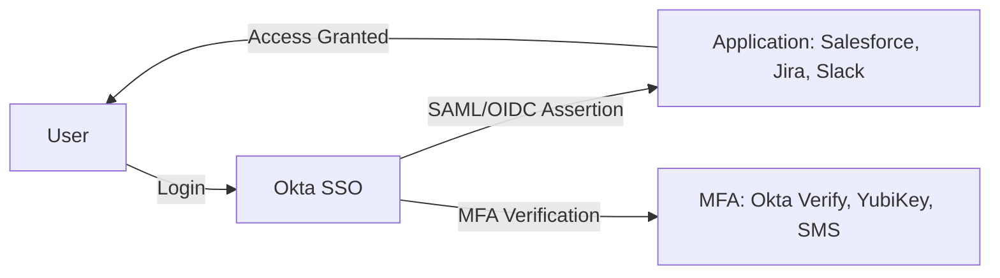

<h2>Application Integration with SSO</h2>

##  Project Overview

This project demonstrates how to integrate enterprise applications with **Okta Single Sign-On (SSO)** using industry standards like **SAML 2.0** and **OIDC (OpenID Connect)**. The goal is to centralize authentication, strengthen security with MFA, and simplify access management across apps.


##  Architecture




##  Key Features

* **SAML 2.0 & OIDC Support**: Integrated multiple apps with Okta.
* **Centralized Authentication**: All apps redirect users to Okta for login.
* **Adaptive MFA**: Enforced contextual MFA (e.g., location-based, device-based).
* **Automated App Assignment**: Group-based assignment for Salesforce, Jira, and Slack.
* **Session Management**: Configured app session lifetimes via Okta policies.

---

##  Implementation

### 1. **SAML Integration**

* Configured Salesforce as a **SAML SP (Service Provider)**.
* Added Salesforce app in Okta → provided **SSO URL & Entity ID**.
* Uploaded **Okta metadata XML** to Salesforce.
* Configured **attribute statements**:

  ```xml
  <AttributeStatement>
    <Attribute Name="email" Format="urn:oasis:names:tc:SAML:1.1:nameid-format:emailAddress">
      <AttributeValue>${user.email}</AttributeValue>
    </Attribute>
    <Attribute Name="firstName">${user.firstName}</Attribute>
    <Attribute Name="lastName">${user.lastName}</Attribute>
  </AttributeStatement>
  ```

---

### 2. **OIDC Integration**

* Configured Slack using **OIDC** in Okta.
* Registered Slack as an **OIDC client** in Okta (Client ID & Secret).
* Configured **redirect URIs** in Slack.
* Added scopes (`openid`, `profile`, `email`) for claims.

Sample OIDC Access Token Payload:

```json
{
  "sub": "00u1abcdEFG1234XYZ",
  "name": "John Doe",
  "email": "john.doe@example.com",
  "groups": ["Engineering", "Slack Users"]
}
```

---


---

##  Outcomes

* **One-click access** to enterprise apps via Okta Dashboard.
* **Improved compliance** with centralized SSO logs.
* **Reduced IT workload** by automating app assignments.

---

